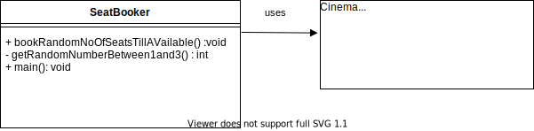

#Cinnamon Cinema

## Requirements 

Develop a program to allocate seats to customers purchasing tickets for a movie theatre.

The Cinnamon Cinemas Movie Theatre has 15 seats, arranged in 3 rows of 5.
 Rows are assigned a letter from A to C
 Seats are assigned a number from 1 to 5

Seats are allocated starting from seat A1 and filling the auditorium from left to right, 
front to back.

All the seats are available for sale when the program starts.

Write a program that allocates seats based on a random integer “number of seats” between 1 and 3.

The program should continue to allocate a random number of seats until it finds there are not enough seats 
left to complete the request.
Once there are not enough seats available to be allocated then the program can halt.

## Solution

### Design

I am starting with implementing the simplest solution to satisfy the requirements.

Constraints :

1. The console app will call the Cinema class to allocate random number of seats between 1 and 3 till
   the request cannot be fulfilled. Here the cinema may still have seats available but not enough to fulfill the 
   request.
2. The Cinema class returns only true or false to indicate seats could be allocated and  does not return the allocated seat numbers.
3. The allocation can be split across two rows for a request.

## Completed Enhancements 

1. Return the allocated seat number. 
    The allocated seat numbers are returned as a List of strings in the format "<Seat Name><Column number>"

2. Do not split a single request across rows. This would require the program to look at previous rows to allocate any empty seats. 
   Seats are allocated together within the same row. 

3. Create customised seating plan by specifying the number of rows and seats in a row. Each row has the same number of seats, in a grid structure.
   
4. Support further customisation of the seating plan by allowing variable number of columns in each or some rows.

## Further feature Enhancements

5. Customise the row names instead of generating them. 
6. Display seating plan. 
7. Allow user to choose seats. 

## Further code enhancements

 Use Junit 5 for testing - used Parameterized test cases.

2. Do not check rows that are full or have less than required no of seats

